<h2 align="center">
    01. Introducción a Git
  
</h2>

  
<h3 style="display: inline">🧠 ¿Qué es un Control de Versiones?</h3>

Un **control de versiones** es un sistema que registra cada cambio realizado en los archivos de un proyecto.  
Permite:

- 📜 Llevar un historial completo de cambios.  
- 🧍 Saber *quién* hizo el cambio y *cuándo*.  
- 🔐 Mantener la seguridad y consistencia del código.  
- 🔄 Ofrece flexibilidad: no obliga a un desarrollo lineal.

 

  
<h3 style="display: inline"> 📜 Breve Historia</h3>

| Año   | Evento                                                    |
|-------|-----------------------------------------------------------|
| 1990  | Nace **CVS**, el primer sistema de control de versiones. |
| 2005  | Se crea **Git**, impulsado por **Linus Torvalds**.       |
| 2008  | Aparece **GitHub**, desarrollado en Ruby on Rails.       |
| 2018  | **Microsoft compra GitHub**.                             |
| 2024  | Git domina el mercado (GitHub, GitLab, Bitbucket).       |

 

  
<h3 style="display: inline">🧰 ¿Qué es Git?</h3>

**Git** es un sistema de control de versiones distribuido que permite trabajar con repositorios locales y remotos de forma eficiente y segura.

 

  
<h3 style="display: inline">📁 ¿Qué es un Repositorio?</h3>

Un **repositorio** es una carpeta que contiene:

- Las distintas versiones de los archivos.
- El historial completo de cambios.

Puede ser:

- 📍 **Local**: en tu máquina.
- 🌐 **Remoto**: en un servidor (GitHub, GitLab, etc.).

 

  
<h3 style="display: inline">🚀 Instalación de Git (Haz clic para ver)</h3>

👉 Descarga Git desde: [https://git-scm.com/downloads](https://git-scm.com/downloads)

Pasos clave durante la instalación:

1. Selecciona la carpeta de destino.

    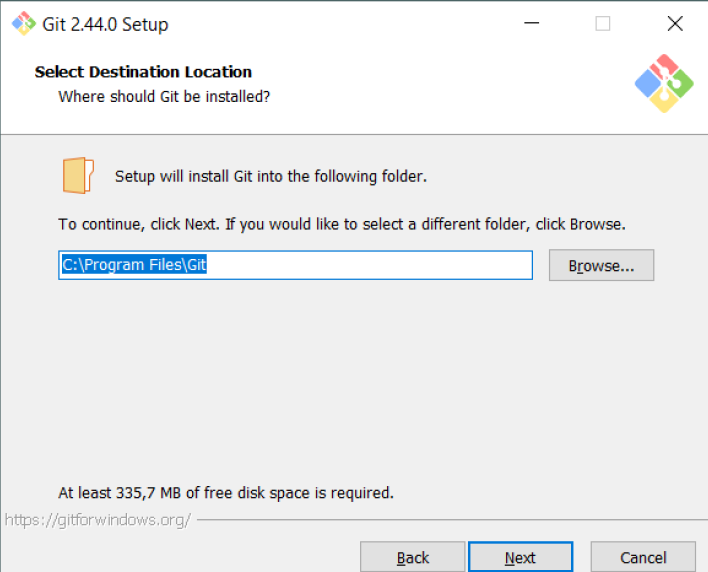
2. Seleccionar todo los componenetes

    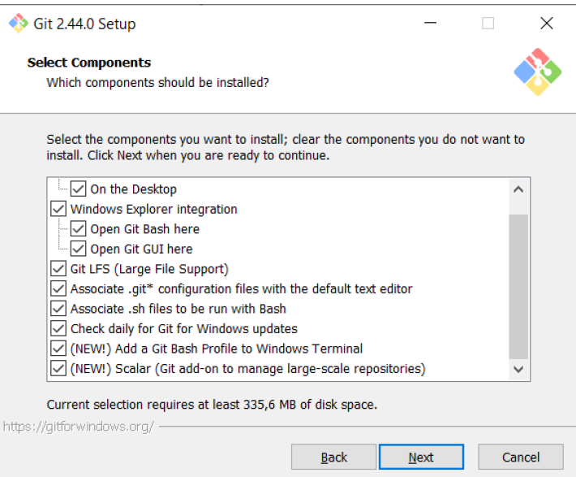
3. Agregar un shortcut del programa con el nombre Git.

    
4. Se debe agregar un IDE o neditor de texto como VIM NANO

    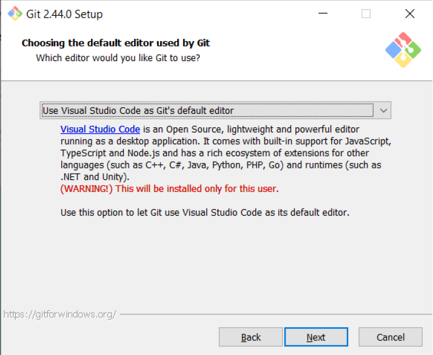
5. Selecionamos Crear una rama por defecto Escribimos `"main"`

     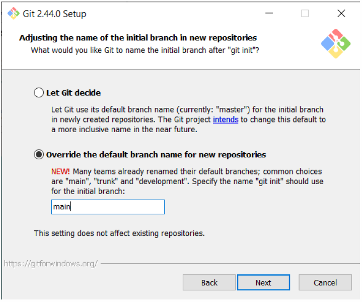
6. Selecionamos la opcion recomendada

    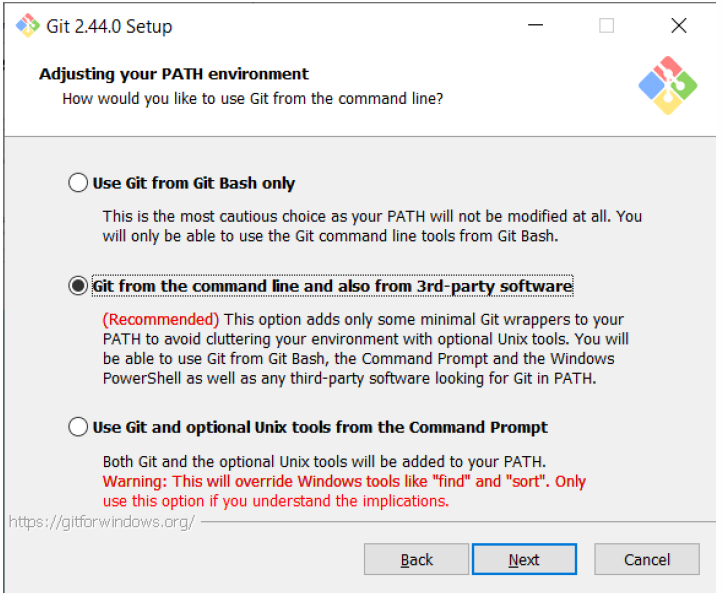
7. Dejamos la opcion SSH

    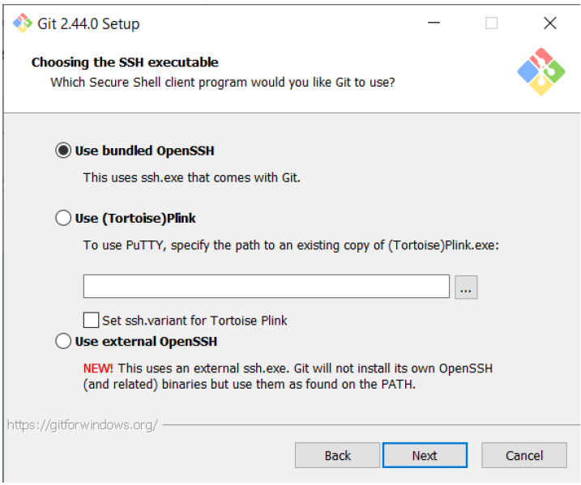
8. Dejamos el OpenSSL

    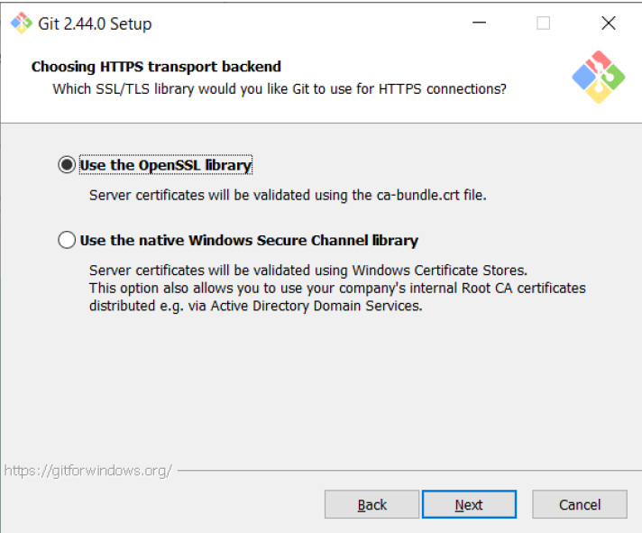
9. Seleccionamos la primara opcion _Si tuvieramos Unix la segunda opcion_

     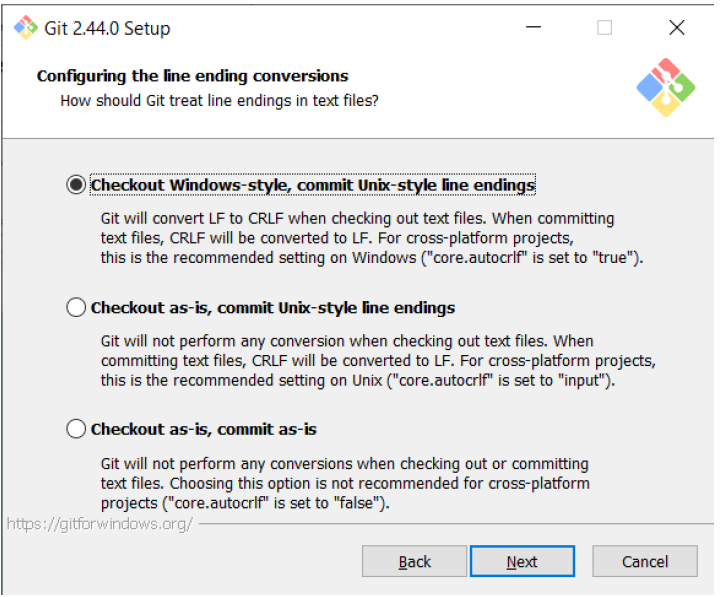
10. Dejamos la interfaz predeterminada. 

    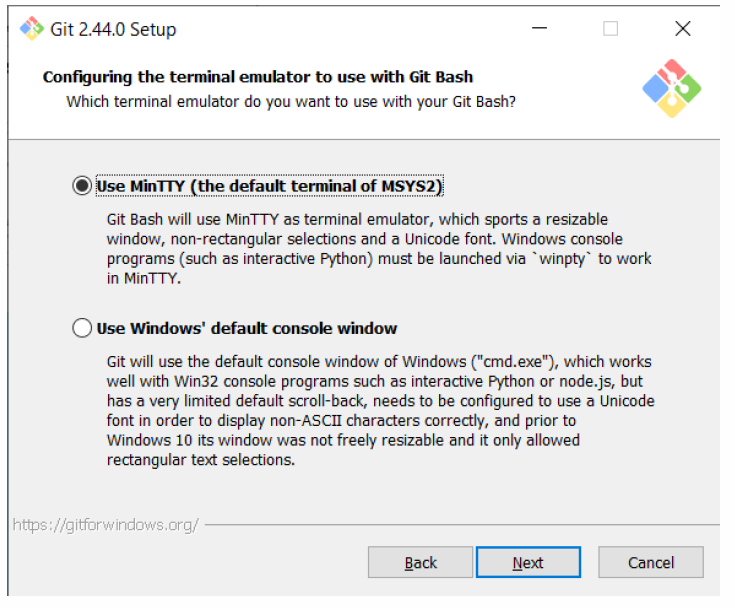
11. Nos servira despues pero lo dejamos en Fast-Forward or merge.

    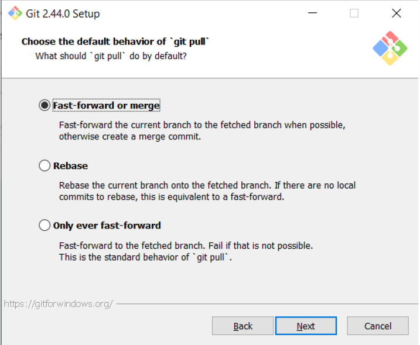
12. Dejamos la opcion por defecto.

    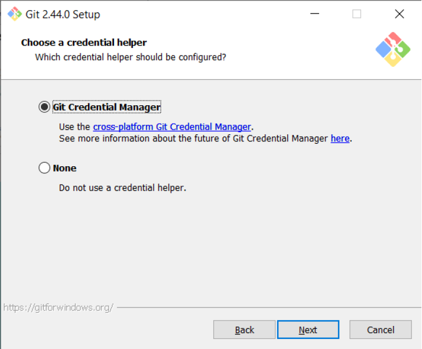
13. Habilitamos la primera opción para ejecutar algunos comandos más rápido debido a la caché.

    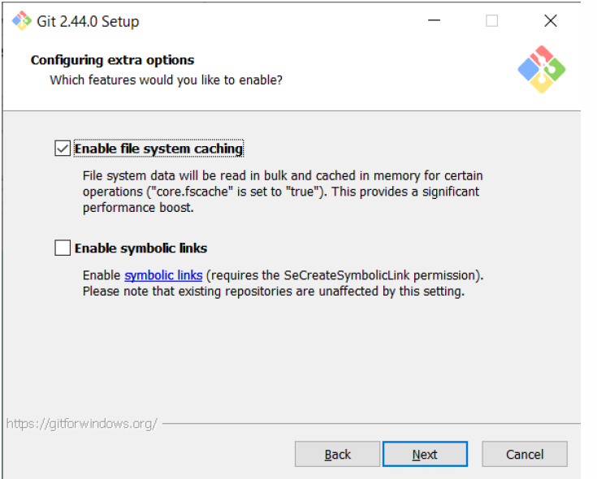

14. No seleccionamos nada directamente install

    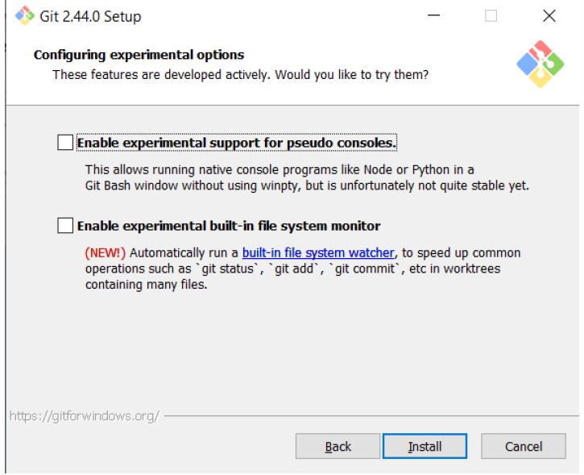
---

 

  
<h3 style="display: inline">📘 Primeros comandos en Git </h3>

**Estos comandos te ayudaran a configurar tu Git una vez Instalado. Suerte ❗❗❗**

| Nº | Comando                                               | Descripción breve                                      |
|----|--------------------------------------------------------|---------------------------------------------------------|
| 1  | `git --version`                                       | Verifica la versión de Git instalada                   |
| 2  | `git commit -am "mensaje"`                            | Hace commit y agrega cambios en archivos ya trackeados |
| 3  | `git help`                                            | Muestra ayuda general de Git                           |
| 4  | `git --help config`                                   | Muestra ayuda específica del comando `config`          |
| 5  | `git config --global user.name "Tu nombre"`           | Configura el nombre de usuario global                  |
| 6  | `git config --global user.email "Tu gmail"`           | Configura el correo global              |
| 7  | `git config --global -e`                              | Abre el editor para configurar Git                    |
| 8  | `:wq`                                                 | Comando para guardar y salir en editores como Vim o Nano     |

