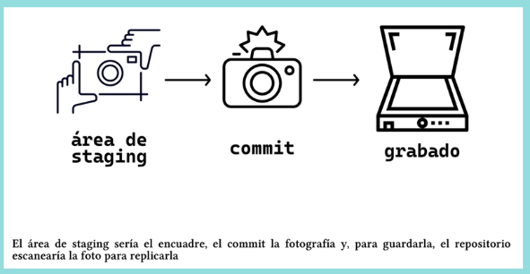

# 2 Inicia tu Proyecto con Git & GitHub 🧑‍💻
### Aprenderas conceptos como **Estados y Commmits**📝
<details>
  <summary><strong> 📌 Paso 1: Crear tu Proyecto con Git </strong></summary>
  
<div style="display: flex; justify-content: space-between; align-items: flex-start;">

<div style="flex: 2; padding-right: 20px;">


1. Abre tu terminal y crea una carpeta para tu proyecto:
   ```bash
   mkdir mi-proyecto
   cd mi-proyecto
   ```

2. Inicializa Git en esa carpeta:
   ```bash
   git init
   ```
   Esto crea un repositorio Git vacío en tu carpeta.

3. Crea un archivo inicial:
   ```bash
   echo "# Mi primer proyecto con Git" > README.md
   ```
</div>  </div> </details> 
</details>

<details>
  <summary><strong> 🔍 Paso 2: Verifica el Estado de los Archivos </strong></summary>
  <div style="display: flex; justify-content: space-between; align-items: flex-start;">

<div style="flex: 2; padding-right: 20px;">

  
Usa este comando para ver en qué estado están tus archivos:
```bash
git status
```

Los archivos pueden estar en uno de tres estados:

| Estado       | Significado                                                                 |
|--------------|------------------------------------------------------------------------------|
| 📝 Modified  | El archivo fue modificado pero aún no está listo para confirmar (commit).    |
| 📥 Staged    | El archivo fue agregado al área de preparación (*stage*) para confirmar.    |
| ✅ Committed | El archivo ya fue registrado en el historial del repositorio.               |
| 🚫 Untracked | El archivo no está siendo rastreado por Git, es decir, no ha sido agregado al área de *staging* ni al repositorio. |


</div>  </div> </details> 
</details>
<details>
  <summary><strong> 📥 Paso 3: Agregar Archivos al Área de Stage </strong></summary>
  <div style="display: flex; justify-content: space-between; align-items: flex-start;">

<div style="flex: 2; padding-right: 20px;">

Antes de guardar tus cambios, debes agregarlos al área de *staging*:
```bash
git add README.md
```
Esto mueve el archivo al área de preparación.
 ***Nota 📝***
 Tambien se puede usar 
 ```bash
git add .
```
Sirve para añadir todo los archivos del *stating*:

</div>  </div> </details> 
</details>

<details>
  <summary><strong> 📸 Paso 4: Crear un Commit </strong></summary>
  <div style="display: flex; justify-content: space-between; align-items: flex-start;">

<div style="flex: 2; padding-right: 20px;">


Un *commit* guarda el estado actual de tus archivos. Incluye:

- Qué archivos cambiaron  
- Quién hizo el cambio  
- Cuándo se hizo  
- Un mensaje explicativo

```bash
git commit -m "Agrega archivo README con descripción inicial"
```
> 🧠 Piensa en el *commit* como una fotografía del proyecto: puedes volver a este punto si algo falla.

---
</div>  </div> </details> 
</details>
<details>
  <summary><strong> 🧭 ¿Qué es el HEAD? </strong></summary>

- `HEAD` es un puntero especial que indica tu posición actual en el historial de *commits*.  
- Siempre apunta al último commit activo.  
- Es como el “usted está aquí” en un mapa de versiones.

</details>

<details>
  <summary><strong>🧵 Uso de Wildcards y Directorios </strong></summary>

### 📂 Agregar archivos específicos por tipo

- Los **wildcards** (comodines) permiten seleccionar varios archivos según su extensión o ubicación.

```bash
git add *.html         # Agrega todos los archivos .html en el directorio actual
git add js/*.js        # Agrega todos los archivos .js dentro de la carpeta /js
git add namefile/      # Agrega todos los archivos dentro del directorio "namefile"
```
## En caso de guardar directorios vacios 📂
- Git no guarda carpetas vacías por defecto. Para solucionarlo, se usa un archivo especial llamado `.gitkeep`.

```bash
# Crear archivo oculto dentro del directorio vacío
touch namefile/.gitkeep
```
## Git Diff 
- El comando git diff muestra las diferencias entre los archivos modificados y su versión anterior.
```bash
git diff
```
</details>
<details>
  <summary><strong>🧩 Creando tus alias en Git </strong></summary>

- Los alias en Git te permiten acortar comandos largos con abreviaciones que tú defines.

- Por ejemplo, para ver el estado de tus archivos en formato resumido:

```bash
git status --short
```
- Puedes crear un alias llamado s así:

```bash
git config --global alias.s status --short
```

- Ahora, en lugar de escribir todo el comando largo, solo usarás:

```bash
git s
```
- ***⚠️ Nota: La única restricción es que el alias no puede tener el mismo nombre que un comando oficial de Git.***

</details>

